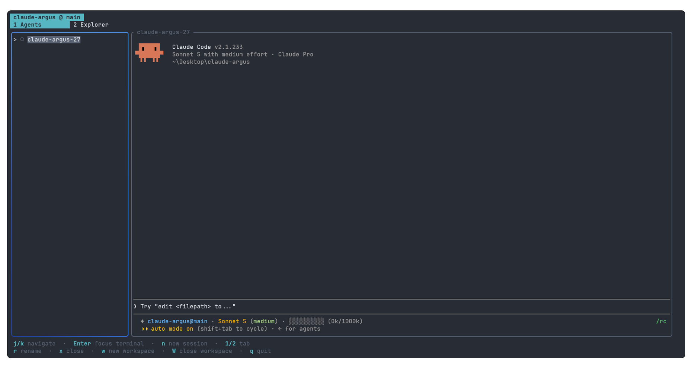

<div align="center">

# Argus

**Terminal UI que gerencia múltiplas sessões do Claude Code**

[](https://www.rust-lang.org/)
[](#instala%C3%A7%C3%A3o)

</div>

<p align="center">
  
</p>

## O que é

`argus` é uma TUI em Rust que gerencia processos `claude` como uma IDE gerenciaria abas: você
abre um diretório como **Workspace** e roda quantas **Sessions** do Claude Code precisar dentro
dele, cada uma em seu próprio PTY, lado a lado num grid redimensionável — sem precisar de várias
janelas de terminal ou `tmux` manual.

O modelo de domínio completo (Workspace, Session, Feature Group, Region, Panel, etc.) está
documentado em [`CONTEXT.md`](CONTEXT.md); as decisões de arquitetura, uma por uma, em
[`docs/adr/`](docs/adr).

## Funcionalidades

- **Múltiplas sessões por workspace** — cada Session roda seu próprio `claude` num PTY isolado;
  feche uma sem afetar as outras.
- **Grid estilo tmux** — as Sessions ativas se organizam num split livremente redimensionável,
  e você pode arrastar uma célula sobre outra para trocar posições.
- **Status em tempo real** — cada Session mostra se está `Thinking`, `Idle` ou `Waiting` (bloqueada
  numa decisão), lido diretamente dos hooks do Claude Code, não por parsing de PTY.
- **Feature Groups** — organize as Sessions de um workspace em grupos coloridos definidos por
  você; filtre o grid por grupo sem fechar nada.
- **File Explorer integrado** — árvore de arquivos com badge de `git status` por arquivo
  (e propagado para as pastas ancestrais), com criar/renomear/mover/excluir.
- **Editor embutido** — abra um arquivo do File Explorer num editor Monaco em split ao lado do
  terminal, com abas para múltiplos arquivos e detecção de conflito de edição externa.
- **Path reference por drag-and-drop** — arraste um arquivo do File Explorer para dentro do
  terminal e ele insere o caminho relativo, pronto para você completar o comando.
- **i18n de verdade** — toda a UI (não a saída do Claude) é traduzível; nenhum texto fica
  parcialmente traduzido em nenhum idioma que o argus suporte.

## Instalação

### 1. Instalar o Rust (inclui `cargo`)

```sh
curl --proto '=https' --tlsv1.2 -sSf https://sh.rustup.rs | sh
source "$HOME/.cargo/env"
```

Verifique:

```sh
rustc --version
cargo --version
```

### 2. Instalar o Claude Code

Precisa estar disponível no `PATH` como `claude`. Siga o guia oficial:
[claude.com/product/claude-code](https://claude.com/product/claude-code).

### 3. Clonar e compilar

```sh
git clone https://github.com/luizfranzon/claude-argus.git
cd claude-argus
cargo build
```

## Uso

Modo desenvolvimento, a partir do diretório atual:

```sh
cargo run -p argus-tui
```

### Atalhos essenciais

| Tecla     | Ação                                   |
| --------- | -------------------------------------- |
| `j` / `k` | Navegar entre sessões                  |
| `Enter`   | Focar o terminal da sessão selecionada |
| `n`       | Nova sessão                            |
| `r`       | Renomear sessão                        |
| `x`       | Fechar sessão                          |
| `w` / `W` | Nova workspace / fechar workspace      |
| `1` / `2` | Alternar entre Agents e Explorer       |
| `q`       | Sair                                   |

### Configuração

| Variável de ambiente | Padrão | Efeito                                                                                                                                                                                                                              |
| --------------------- | ------ | ------------------------------------------------------------------------------------------------------------------------------------------------------------------------------------------------------------------------------------ |
| `ARGUS_FPS`           | `120`  | Taxa de redraw da UI, em quadros por segundo. Argus converte sozinho para o intervalo em milissegundos (`1000 / ARGUS_FPS`) — você só informa quantos FPS quer. Valores maiores reduzem a latência entre um evento (scroll, tecla, saída do `claude`) e ele aparecer na tela, ao custo de mais CPU; valores menores economizam CPU (útil em SSH/máquinas fracas). Aceita `1` a `1000`; valor ausente, inválido ou fora da faixa cai no padrão. |

```sh
ARGUS_FPS=240 argus   # mais responsivo, mais CPU
ARGUS_FPS=30 argus    # mais leve, ideal para SSH/hardware fraco
```

## Distribuição

Para instalar o binário `argus` no `PATH` (`~/.cargo/bin`), igual ao `claude`:

```sh
cargo install --path crates/argus-tui
```

A partir daí, rodar `argus` em qualquer diretório abre a TUI e cria a workspace
nesse diretório — mesmo comportamento do Claude Code.

## Arquitetura

O código segue Clean Architecture em crates separadas por camada (ver [ADR-0001](docs/adr/0001-clean-architecture-rust-crates.md)):

```
crates/
├── argus-domain          # Entidades e regras de negócio puras (Session, Workspace, políticas)
├── argus-application     # Casos de uso e ports (interfaces para o mundo externo)
├── argus-infrastructure  # Adapters: PTY, filesystem, watchers, hooks do Claude Code
└── argus-tui             # A interface em si, construída com ratatui
```

## Troubleshooting

### 1. Ícones do File Explorer aparecem como quadrados/caixas vazias

O File Explorer usa glyphs de [Nerd Font](https://www.nerdfonts.com/) (Font
Awesome, codepoints da área de uso privado do Unicode) para os ícones de
pasta e arquivo — veja `crates/argus-tui/src/icons.rs`. Sem uma Nerd Font
configurada como fonte do terminal, esses codepoints não têm glyph
correspondente e aparecem como caixa vazia, `?` ou espaço em branco.

Isso é configuração do **terminal**, não do Argus: se você abre o Argus em
terminais diferentes (ex: Windows Terminal vs. terminal integrado do editor),
cada um usa sua própria fonte, então o resultado pode variar entre eles.

Para corrigir:

1. Baixe e instale uma Nerd Font (ex: `JetBrainsMono Nerd Font`, `FiraCode
Nerd Font`, `Hack Nerd Font`) em
   [nerdfonts.com/font-downloads](https://www.nerdfonts.com/font-downloads).
2. Configure essa fonte nas preferências do terminal onde os ícones não
   aparecem corretamente.
3. Reabra o terminal e rode `argus` novamente.

### 2. File watching (rename de sessão, File Explorer) não atualiza sozinho

Argus usa `inotify` para observar `~/.claude/sessions` (rename ao vivo) e a
raiz de cada workspace (File Explorer). Se o limite de
instâncias `inotify` do seu usuário já estiver esgotado por outros programas
(editores, watchers de build, GitKraken etc.), o `watch()` falha em silêncio
com `Too many open files` (`os error 24`) e Argus continua funcionando, só
sem essas atualizações automáticas.

Confira se bateu o limite:

```sh
cat /proc/sys/fs/inotify/max_user_instances
```

Falhas de watch ficam registradas em `~/.claude/argus-watch-errors.log`.

Para resolver, aumente o limite:

```sh
sudo sysctl fs.inotify.max_user_instances=1024
```

Para persistir entre reboots:

```sh
echo "fs.inotify.max_user_instances=1024" | sudo tee /etc/sysctl.d/99-inotify.conf
sudo sysctl --system
```

## Contribuindo

Issues são rastreadas no GitHub (`luizfranzon/claude-argus`) usando o vocabulário de labels
padrão (`needs-triage`, `needs-info`, `ready-for-agent`, `ready-for-human`, `wontfix`). Antes de
abrir uma PR, dê uma olhada em [`CONTEXT.md`](CONTEXT.md) para o vocabulário de domínio e em
[`docs/adr/`](docs/adr) para o histórico de decisões — evita reintroduzir algo que já foi
decidido e revertido.

---

<div align="center">
<sub>Construído para orquestrar o Claude Code, não para competir com ele.</sub>
</div>
